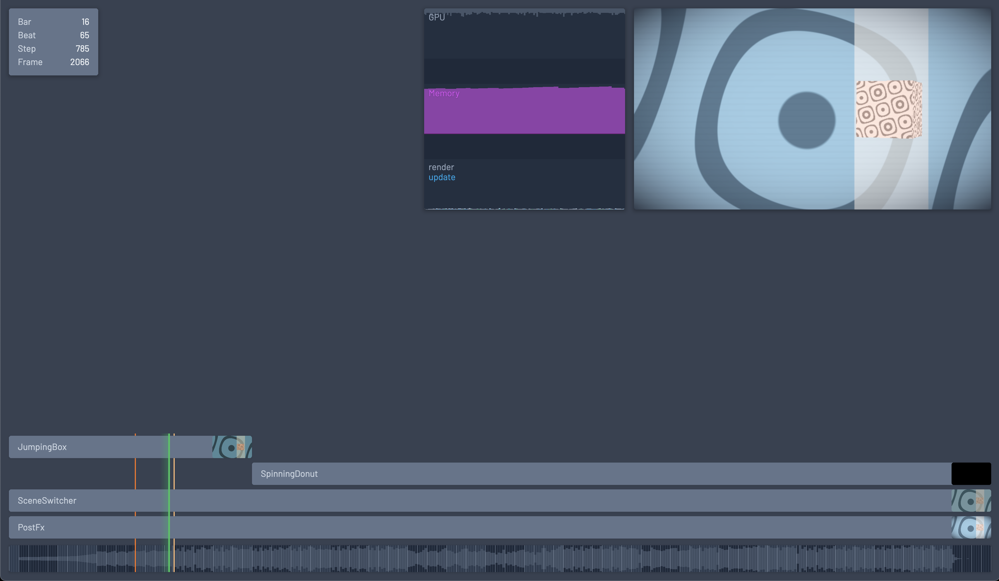

<h1 align="center">r e n i n</h1>

<p align=center> <a href="#getting-started">Getting started</a> • <a href="#project-status">Project status</a></p>


> <sup>DISCLAIMER: This is a tool created for internal use by Ninjadev, and is open sourced to share ideas with and get feedback from the community. You are free to use it, according to the License, but we will not necessarily provide support and may at any time add, change or remove features as we require for our productions.</sup>

<pre align="center">

</pre>

<br/><br/>

<p align="center">
Renin is a browser-based demo creation library and tool built on top of <a href="https://github.com/mrdoob/three.js/">Three.js</a> and <a href="https://vite.dev">Vite</a>.<br/>It is the successor to <a href="https://github.com/ninjadev/nin">nin</a>, Ninjadev's old demo tool.
</p>
  
<br/>

## Getting started

```shell
npx renin init mydemo
cd mydemo
yarn install
yarn run dev
```

Now visit localhost:3000 to start renin. Try modifing the source in mydemo/src/ to get started. Happy hacking!


<br/>

## Project status

Renin is quite new and pretty rough around the edges.
Currently, basic editing, live-reloading and jogging is implemented.
Compilation/export is sort of implemented, but could use some more polish.
As such, it should be able to make a demo with this already :tada:

Rendering to video has not been implemented yet.

<br/>

## How is renin different compared to nin?

- The entire UI is WebGL (threejs).
- No graph.json -- instead, the graph is implicitly defined in the code directly in the node relationships.
- New experimental visualization of nodes as layers.
- Typescript and modern tooling/imports/etc which makes the coding experience much nicer.
- It uses vite "as a backend" instead of the node backend + html frontend architecture of nin.
